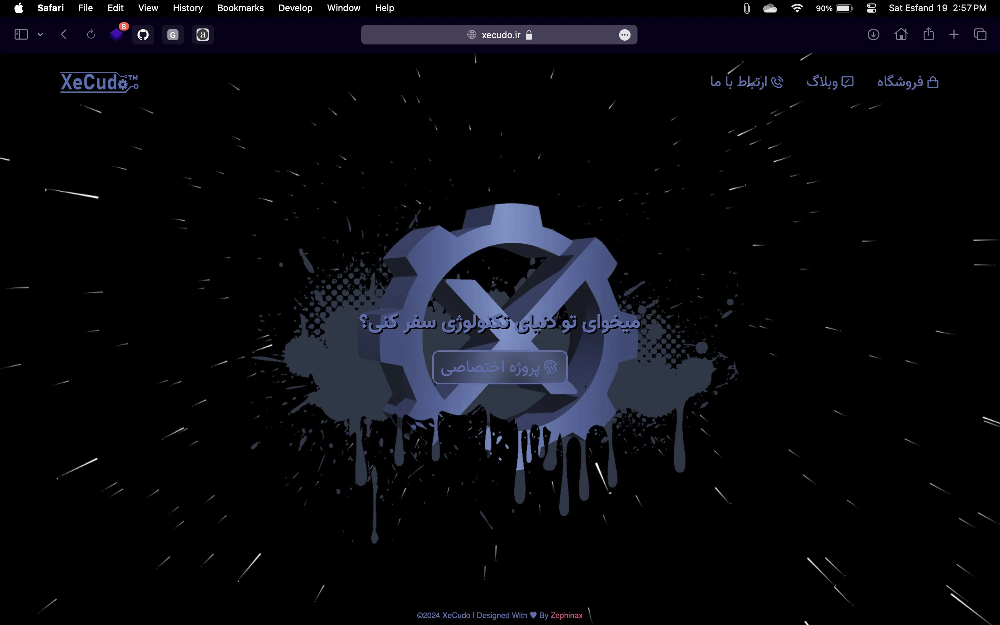

<h2 align="center">
XeCudo Team Home Page 
  <a href="https://xecudo.ir/" target="_blank">Click Here To Show Demo [
    XeCudo.ir]</a>
</h2>
 

 

 &nbsp;
 &nbsp;
 &nbsp;

<h3 align="center">
    🔹
    <a href="https://github.com/Zephinax/XeCudo/issues">Report Bug</a> &nbsp; &nbsp;
    🔹
    <a href="https://github.com/Zephinax/XeCudo/issues">Request Feature</a>
</h3>

## What is this?

This is beautiful home page with 3D design,
You can fork this repo to modify and make changes of your own. Please give me proper credit by linking back to [Zephianx](https://github.com/Zephinax/XeCudo). Thanks!

## Features

- 🎯 3D Fully Responsive

- 📖 Multi-Page Layout

Give a ⭐ if you like this website!

## Authors

- [@Zephinax](https://github.com/Zephinax)
